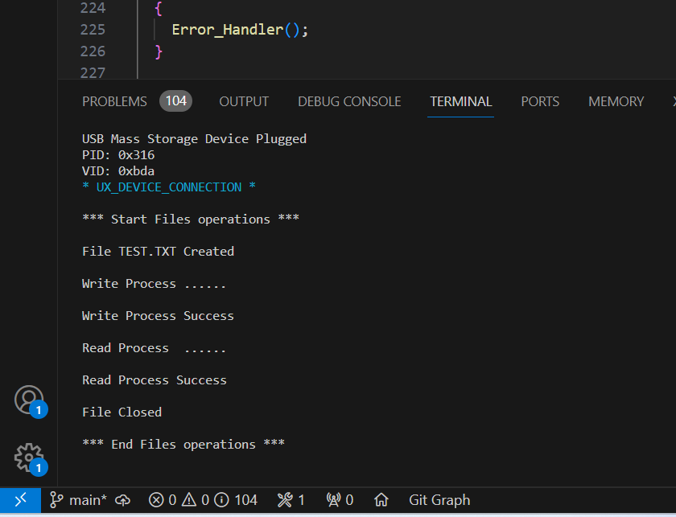
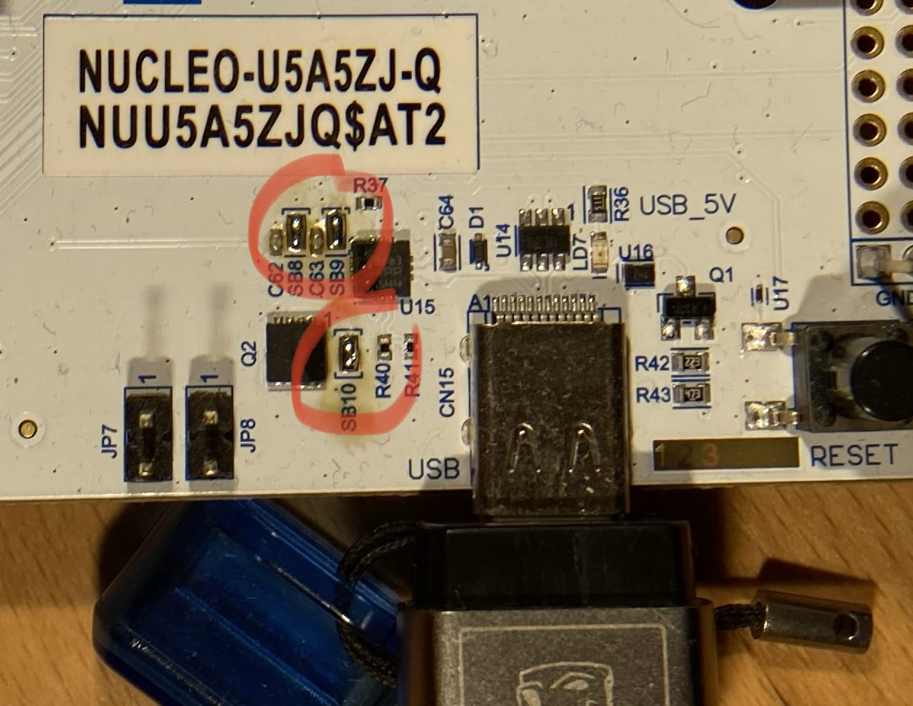
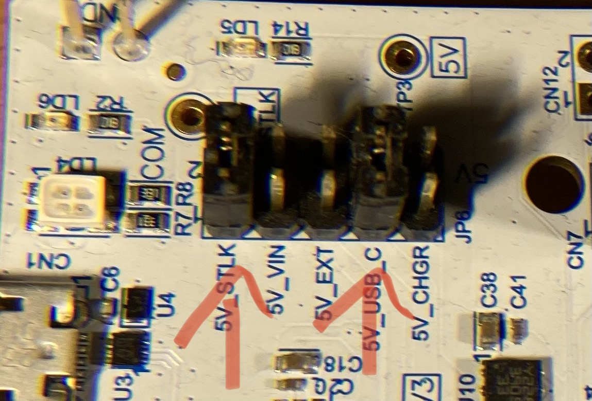

# Nucleo-U5A5ZJ-Q (STM32U5A5), USBX, USB-C host, reading and writing pen drive files
## [Nucleo-U5A5ZJ-Q](https://www.st.com/en/evaluation-tools/nucleo-u5a5zj-q.html) configured as USB-C Host with MSC (mass storage) support
> Note: to provide USB-C power, onboard undocumented jumpers SB8-SB10 must be closed and 2nd JP6 jumper in 5V_USB_C position is required - see below

# VS Code Environment Setup
## Prerequisites
* NodeJS + NPM
* Python + PIP
* Git
* VS Code
## pyOCD
* `pip install pyocd --upgrade` On Windows install as admin, otherwise install is local and PATH setting is required.
* `pyocd pack update`
* `pyocd pack find STM32U5A5`
* `pyocd pack install STM32U5A5ZJTxQ`
## OpenOCD
* Download the latest version from https://github.com/xpack-dev-tools/openocd-xpack/releases
or build it yourself following [this guide](https://github.com/Marus/cortex-debug/wiki/How-to-build-current-OpenOCD-version-on-Windows)
* Unzip it to `OpenOCD` folder in `C:\Program Files`
* Set `OpenOCD` system variable to 'C:\Program Files\OpenOCD'
* Add `%OpenOCD%\bin` to system PATH variable
* Set `XDG_CACHE_HOME` env variable to `%USERPROFILE%\AppData\Local\Temp` to prevent symbol cache path error
> Note: xpm utility does not really support global installations (yet), hence I suggest the above approach.
## SVD file - MPU specific
Download from https://github.com/posborne/cmsis-svd/tree/master/data/STMicro and place in the root folder.
## GNU Arm Embedded Toolchain
* Required version: **arm-none-eabi** (bare-metal target) [10.3-2021.07](https://developer.arm.com/downloads/-/gnu-a)
* Do NOT use latest versions 11.x and 12.x. Newer versions currently have known bugs which may impact build and/or debug process.
* Set `MBED_GCC_ARM_PATH` env variable to `C:\Program Files (x86)\Arm GNU Toolchain arm-none-eabi\10.3 2021.07\bin`
* Add `MBED_GCC_ARM_PATH` env variable to Windows `Path` env variable (`%MBED_GCC_ARM_PATH%`) - if not set by the installer.
## Required NPM packages
* `npm install -g cppbuild`
* `npm install -g shx`
* `npm install -g @serialport/terminal`
## Required VS Code plug-ins
* `C/C++` (Microsoft)
* `Cortex-Debug` (marcus25) See: https://github.com/Marus/cortex-debug/wiki
## VS Code config
* Set the default VS Code terminal to `Git Bash`. Otherwise, VS Code may try to execute task NPM packages as (e.g.) PowerShell scripts.
## Recommended VS Code plug-ins
* `LinkerScript` (Zixuan Wang)
* `Arm Assembly` (dan-c-underwood)
* `Code Spell Checker` (Street Side Software)
* `Build++` (Tomasz Jastrzębski)
## Optional
* [ST-LINK Utility](https://github.com/stlink-org/stlink)
* [STSW-LINK009](https://www.st.com/content/st_com/en/products/development-tools/software-development-tools/stm32-software-development-tools/stm32-utilities/stsw-link009.html) ST-LINK USB Driver
* [STSW-LINK007](https://www.st.com/content/st_com/en/products/development-tools/software-development-tools/stm32-software-development-tools/stm32-programmers/stsw-link007.html) ST-LINK boards firmware upgrade

# References
* [DS13737](https://www.st.com/resource/en/datasheet/stm32u575zi.pdf)
* [RM0456](https://www.st.com/resource/en/reference_manual/rm0456-stm32u5-series-armbased-32bit-mcus-stmicroelectronics.pdf)
* [ES0499](https://www.st.com/resource/en/errata_sheet/es0499-stm32u575xx-and-stm32u585xx-device-errata-stmicroelectronics.pdf)
* [PM0264](https://www.st.com/resource/en/programming_manual/pm0264-stm32-cortexm33-mcus-programming-manual-stmicroelectronics.pdf)
* [UM2861 STM32U5 Nucleo-144 board (MB1549)](https://www.st.com/content/ccc/resource/technical/document/user_manual/group2/01/c3/67/cb/67/3d/44/99/DM00789949/files/DM00789949.pdf/jcr:content/translations/en.DM00789949.pdf)
* [Schematic 2.0](https://www.st.com/content/ccc/resource/technical/layouts_and_diagrams/schematic_pack/group1/f1/6c/26/bc/a0/a0/48/d7/MB1549-U575ZIQ-C02_Schematic/files/MB1549-U575ZIQ-C02_Schematic.PDF) 