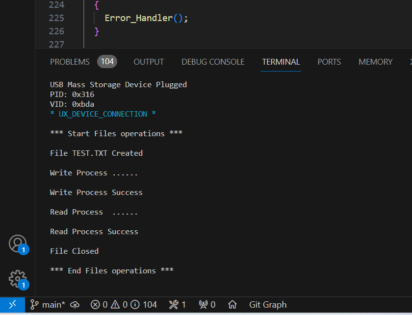
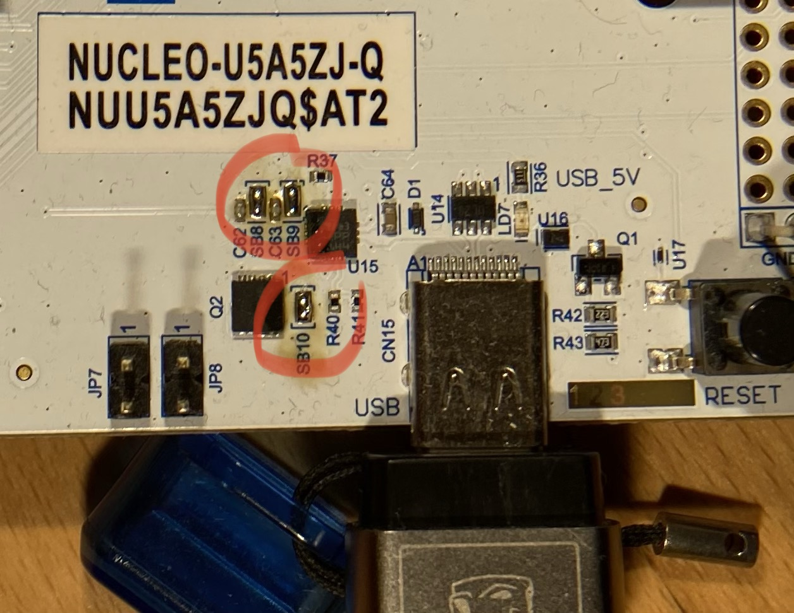
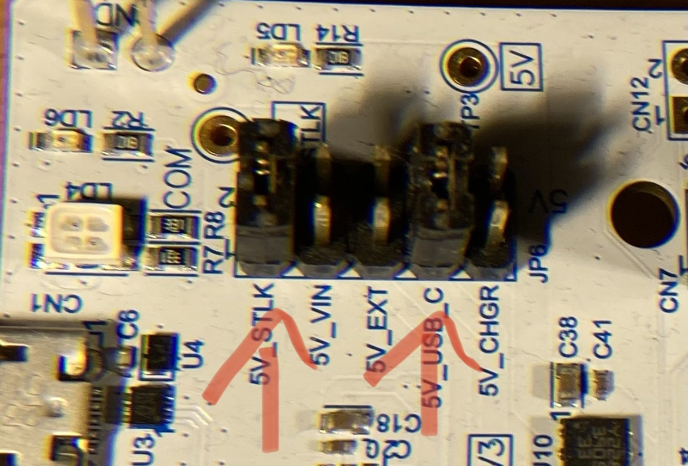

# Nucleo-U5A5ZJ-Q (STM32U5A5) USBX USB-C Host Demo

USBX demo for the **Nucleo-U5A5ZJ-Q (STM32U5A5)** board configured as a **USB-C host**, demonstrating USB Mass Storage Class (MSC) support and file read/write operations on a USB flash drive, with UCPD support.

## Nucleo-U5A5ZJ-Q Board Configuration

The board is configured as a **USB-C host** with USB Mass Storage Class (MSC) and UCPD support.

> **Note:** To provide power to the USB-C port, the undocumented onboard jumpers **SB8–SB10** must be closed to disable the **TCPP01-M12** chip, which is not capable of sourcing current.

> In addition, the **second JP6 jumper** must be set to the **5V_USB_C** position.

## Required Manual Configuration

The following macros must be configured manually:

```c
UX_APP_MEM_POOL_SIZE          40*1024 // app_azure_rtos_config.h
FX_APP_MEM_POOL_SIZE           2*1024 // app_azure_rtos_config.h
USBX_MEMORY_STACK_SIZE        24*1024 // app_usbx.h
UX_HOST_APP_THREAD_STACK_SIZE  2*1024 // app_usbx_host.h
```

> **Note:** Make sure the above macros are defined correctly. CubeMX 6.18 has a bug that may prevent these settings from being persisted, which can result in a `USBX App init error`.







# VS Code Environment Setup

## Prerequisites

* NodeJS + NPM
* Python + PIP
* Git
* VS Code

## pyOCD

* Install or upgrade pyOCD:

  ```bash
  pip install pyocd --upgrade
  ```

* On Windows, run the installation as Administrator. Otherwise, the installation may be local, in which case the installation directory must be added to `PATH`.

* Update the pyOCD pack index:

  ```bash
  pyocd pack update
  ```

* Find the STM32U5A5 pack:

  ```bash
  pyocd pack find STM32U5A5
  ```

* Install the STM32U5A5 device pack:

  ```bash
  pyocd pack install STM32U5A5ZJTxQ
  ```

## OpenOCD

* Download the latest version from [xpack-dev-tools/openocd-xpack/releases](https://github.com/xpack-dev-tools/openocd-xpack/releases), or build OpenOCD using the [Cortex-Debug guide](https://github.com/Marus/cortex-debug/wiki).

* Unzip OpenOCD to:

  ```text
  C:\Program Files\OpenOCD
  ```

* Set the `OpenOCD` system variable to:

  ```text
  C:\Program Files\OpenOCD
  ```

* Add `%OpenOCD%\bin` to the system `PATH`.

* Set `XDG_CACHE_HOME` to:

  ```text
  %USERPROFILE%\AppData\Local\Temp\
  ```

  This prevents symbol cache path errors.

> **Note:** The `xpm` utility does not currently provide reliable support for global installations, hence the installation method described above is recommended.

## SVD File — MCU Specific

Download the appropriate SVD file from the [CMSIS-SVD GitHub repository](https://github.com/ARM-software/CMSIS-SVD) and place it in the project root directory.

## GNU Arm Embedded Toolchain

Required toolchain: **`arm-none-eabi` 13.0 or newer**.

Do **not** use versions prior to 13. They have known bugs that may affect the build and/or debugging process and do not support C23.

* Set the `MBED_GCC_ARM_PATH` environment variable to:

  ```text
  C:\Program Files (x86)\Arm GNU Toolchain arm-none-eabi\<revision>\bin
  ```

* Add `%MBED_GCC_ARM_PATH%` to the Windows `PATH` environment variable if it was not added automatically by the installer.

## Required NPM Packages

```bash
npm install -g cppbuild
npm install -g shx
npm install -g @serialport/terminal
```

## Required VS Code Extensions

* **C/C++** — Microsoft
* **Cortex-Debug** — marus25

See the [Cortex-Debug wiki](https://github.com/Marus/cortex-debug/wiki) for additional information.

## VS Code Configuration

Set the default VS Code terminal to **Git Bash**.

Otherwise, VS Code may attempt to execute NPM package commands as PowerShell scripts.

## Recommended VS Code Extensions

* **LinkerScript** — Zixuan Wang
* **Arm Assembly** — dan-c-underwood
* **Code Spell Checker** — Street Side Software
* **Build++** — Tomasz Jastrzębski

## Optional

* **ST-LINK Utility**
* **STSW-LINK009** — ST-LINK USB Driver
* **STSW-LINK007** — ST-LINK board firmware upgrade

# References

* [DS13737](https://www.st.com/resource/en/datasheet/stm32u575zi.pdf) — STM32U575ZI datasheet
* [RM0456](https://www.st.com/resource/en/reference_manual/rm0456-stm32u57556758595x7-reference-manual-stmicroelectronics.pdf) — STM32U5 Series reference manual
* [ES0499](https://www.st.com/resource/en/errata_sheet/es0499-stm32u575xx-stm32u585xx-device-errata-stmicroelectronics.pdf) — STM32U575xx and STM32U585xx device errata
* [PM0264](https://www.st.com/resource/en/programming_manual/pm0264-stm32-cortexm33-mcus-programming-manual-stmicroelectronics.pdf) — STM32 Cortex-M33 programming manual
* [UM2861](https://www.st.com/resource/en/user_manual/um2861-stm32u5-nucleo144-board-mb1549-stmicroelectronics.pdf) — STM32U5 Nucleo-144 board (MB1549)
* [Nucleo-U5A5ZJ-Q board schematic 2.0](https://www.st.com/content/ccc/resource/technical/layouts_and_diagrams/schematic_pack/group1/f1/6c/26/bc/a0/a0/48/d7/MB1549-U575ZIQ-C02_Schematic/files/MB1549-U575ZIQ-C02_Schematic.PDF) 
